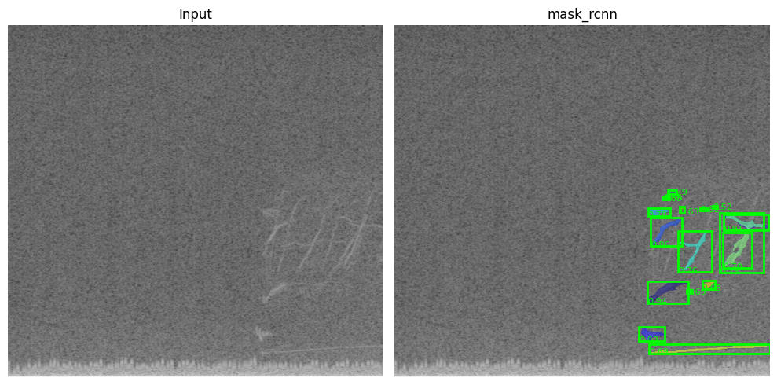

# Alfven Eigenmode Locator

This repository contains the code for the Alfven Eigenmode localization in time, frequency, and space. Resulting models can be directly used in [TokEye](https://github.com/PlasmaControl/tokeye).



## Usage
Install dependencies using [uv](https://docs.astral.sh/uv/):
```bash
uv sync
```

## Data
The data is stored in the `data` directory. Initial time annotations are provided by Bill Heidbrink. Data organization by Azaraksh Jalalvand.

## Model(s)
- `seldnet`: SELDNet model for detecting Alfven eigenmodes.
- `mask_rcnn`: Mask R-CNN model for panatopic segmentation of the Alfven eigenmode.
- `segformer`: SegFormer model for panatopic segmentation of the Alfven eigenmode. (WIP)

## Intentions
- [x] Add time-frequency localization
- [ ] Add space-frequency localization
- [ ] Improve dataset accuracy

## Contact
[Nathaniel Chen](mailto:nathaniel@princeton.edu)
